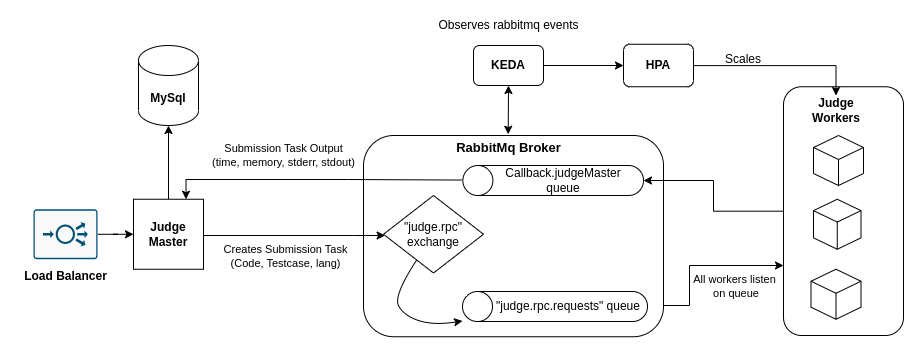

# QubeJudge

Qubejudge provides a scalable and plugable backend solution for remote code execution platforms.  
Some of the the key features of QubeJudge are: 

 - Event-driven architecture  
	 - Judge Tasks sent to cluster of judge workers over RabbitMQ Broker
 - Realtime results sent to client with Websockets
 - Event driven autoscaling of Judge Workers 
	 - Uses [Kubernetes Event Driven Autoscaling](https://keda.sh/) (Keda)
	 - Observes events on RabbitMQ Broker
-  Supports Addition of new programming languages

## Architecture

<!-- ## Deployment Instructions -->
